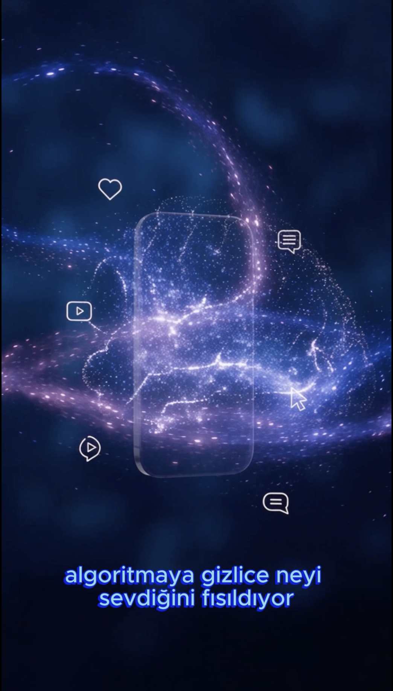

# 🎬 AI Nedir? — Algoritma Nasıl Çalışır? | Eğitici Kısa Video

📺 **YouTube:** [Videoyu İzle](https://youtube.com/shorts/RxaPOeDkZI8?feature=share)

---

## 🇹🇷 Türkçe

### Proje Hakkında
Sosyal medya algoritmalarının kullanıcı davranışından (izlenme süresi, tıklama, beğeni gibi sinyallerden) nasıl öğrendiğini anlatan, tamamen AI araçlarıyla üretilmiş 30 saniyelik eğitici bir kısa video. YouTube Shorts ve LinkedIn için hazırlandı.

Bu proje, "önce ses sonra görsel" prensibiyle üretilen profesyonel bir kısa video üretim sürecini uçtan uca göstermektedir.

1. **Senaryo Yazımı** — Gemini ile zaman kodlu, doğal nefes molaları işaretlenmiş bir seslendirme metni oluşturuldu.
2. **Seslendirme** — ElevenLabs (multilingual model) ile Türkçe seslendirme üretildi. Stability ve clarity ayarları, daha doğal ve duygusal bir ton için özelleştirildi.
3. **Zaman Haritası Çıkarma** — CapCut'ın otomatik altyazı özelliği kullanılarak sesin gerçek zaman kodları (cümle cümle) çıkarıldı.
4. **Görsel Üretim** — Runway AI ile, tek ve detaylı bir prompt kullanılarak 10 saniyelik akıcı, kesintisiz bir sinematik sahne üretildi (telefon ekranı → veri parçacıkları → AI beyin görselleştirmesi).
5. **Senkronizasyon** — Görsel klip, CapCut'ta hız ayarlanarak (10sn → 34sn) seslendirmeyle birebir eşleştirildi.
6. **Kurgu ve Son Dokunuşlar** — Otomatik altyazılar stilize edildi, arka plan müziği eklenip seviyesi seslendirmenin altında (-20dB) dengelendi.

### Kullanılan Teknolojiler
- **Gemini** — Senaryo ve zaman kodlu metin üretimi
- **ElevenLabs** — AI seslendirme (multilingual, Türkçe)
- **Runway AI** — Text-to-video görsel üretimi
- **CapCut** — Kurgu, otomatik altyazı, ses senkronizasyonu, renk/hız düzenleme

### Öne Çıkan Teknik Detaylar
- Ses öncelikli üretim iş akışı (voice-first workflow)
- Waveform tabanlı kesim noktası tespiti
- Tek prompt ile 10 saniyelik kesintisiz sinematik sahne mühendisliği
- Profesyonel ses seviyesi dengeleme standartları

---

## 🇬🇧 English

### About the Project
A 30-second AI-generated educational short video explaining how social media algorithms learn from user behavior (watch time, clicks, likes). Produced for YouTube Shorts and LinkedIn using a fully AI-powered production pipeline.

This project demonstrates an end-to-end, voice-first professional short-video production workflow.

### Production Process

1. **Script Writing** — Wrote a timed Turkish voiceover script with Gemini, marking natural breathing pauses for accurate pacing.
2. **Voiceover** — Generated the voiceover using ElevenLabs (multilingual model), tuning stability and clarity settings for a natural, emotional delivery.
3. **Timing Extraction** — Used CapCut's auto-caption feature to extract precise sentence-level timestamps from the voiceover.
4. **Visual Generation** — Produced a continuous, cinematic 10-second scene with Runway AI using a single, highly detailed prompt (smartphone scroll → data particles → AI brain visualization).
5. **Synchronization** — Adjusted the visual clip's speed in CapCut (10s → 34s) to precisely match the voiceover length.
6. **Editing & Polish** — Styled auto-generated captions, added background music balanced below the voiceover level (-20dB).

### Tech Stack
- **Gemini** — Script writing and timed text generation
- **ElevenLabs** — AI voiceover (multilingual, Turkish)
- **Runway AI** — Text-to-video visual generation
- **CapCut** — Editing, auto-captioning, audio sync, speed/color adjustments

### Key Technical Highlights
- Voice-first production workflow
- Waveform-based cut point detection
- Single-prompt engineering for a seamless 10-second cinematic sequence
- Professional audio level balancing standards
